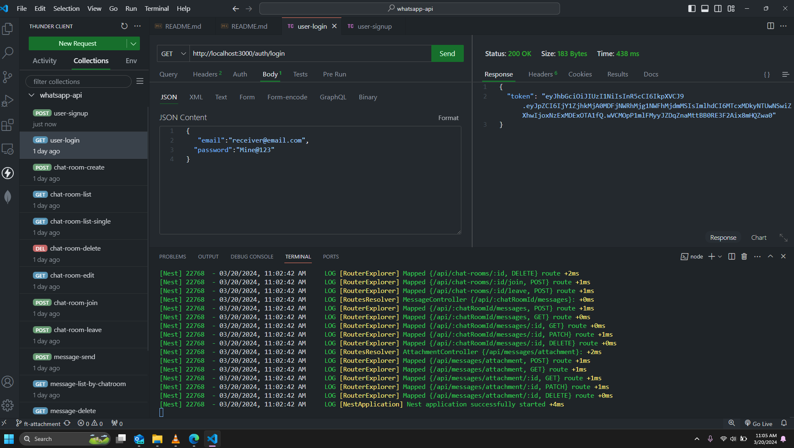

# WhatsApp Clone API

This is a RESTful API for a WhatsApp clone application, developed using NestJS.

## Features

## RDM schema
Sure, here are the tables represented in a document format:

### User Table:


## endpoints testing




## Message queue with Rabbitmq


### Authentication

- **JWT Authentication**: Secure user authentication using JSON Web Tokens (JWT).
- **Sign Up**: Endpoint to register a new user account.
- **Log In**: Endpoint to authenticate existing users.

### Chatroom Management

- **Create Chatroom**: Endpoint to create a new chatroom.
- **Retrieve Chatrooms**: Endpoint to fetch a list of all chatrooms.
- **Join Chatroom**: Endpoint to allow users to join a chatroom.
- **Leave Chatroom**: Endpoint to allow users to leave a chatroom.
- **Update Chatroom**: (Optional) Endpoint to update chatroom details.
- **Delete Chatroom**: (Optional) Endpoint to delete a chatroom.

### Messaging

- **Send Message**: Endpoint to send a message to a specific chatroom.
- **Retrieve Messages**: Endpoint to fetch all messages in a chatroom.
- **Update Message**: (Optional) Endpoint to update a message.
- **Delete Message**: (Optional) Endpoint to delete a message.
- **Attachment Upload**: Ability to attach images, documents, or videos to messages.

### Reaction
#### Message Reaction: ["thumbsup", "love", "crying", "surprised"]

- **React to Message**: Endpoint to react to a message with a specific reaction.
- **Retrieve Reactions**: Endpoint to fetch all reactions to a particular message.
- **Update Reaction**: (Optional) Endpoint to update a reaction.
- **Delete Reaction**: (Optional) Endpoint to delete a reaction.

### Attachment

- **Upload Attachment**: Endpoint to upload an attachment (image, document, video) to a message.
- **Retrieve Attachments**: Endpoint to fetch all attachments associated with a message.
- **Update Attachment**: (Optional) Endpoint to update an attachment.
- **Delete Attachment**: (Optional) Endpoint to delete an attachment.


## Installation

1. Clone the repository: `git clone <repository-url>`
2. Navigate to the project directory: `cd whatsapp-api`
3. Install dependencies: `npm install`

## Configuration

1. Create a `.env` file in the root directory.
2. Add the following environment variables:
   ```
   MONGODB_URI = replace here
   PORT = 3000

   JWT_SECRET = replace here
   JWT_EXPIRES_IN  = replace here
   ```

## Usage

1. Start the server: `npm start`
2. Use API endpoints to perform various actions, such as authentication, chatroom management, and messaging.


## License

This project is licensed under the [MIT License](LICENSE).

---
 